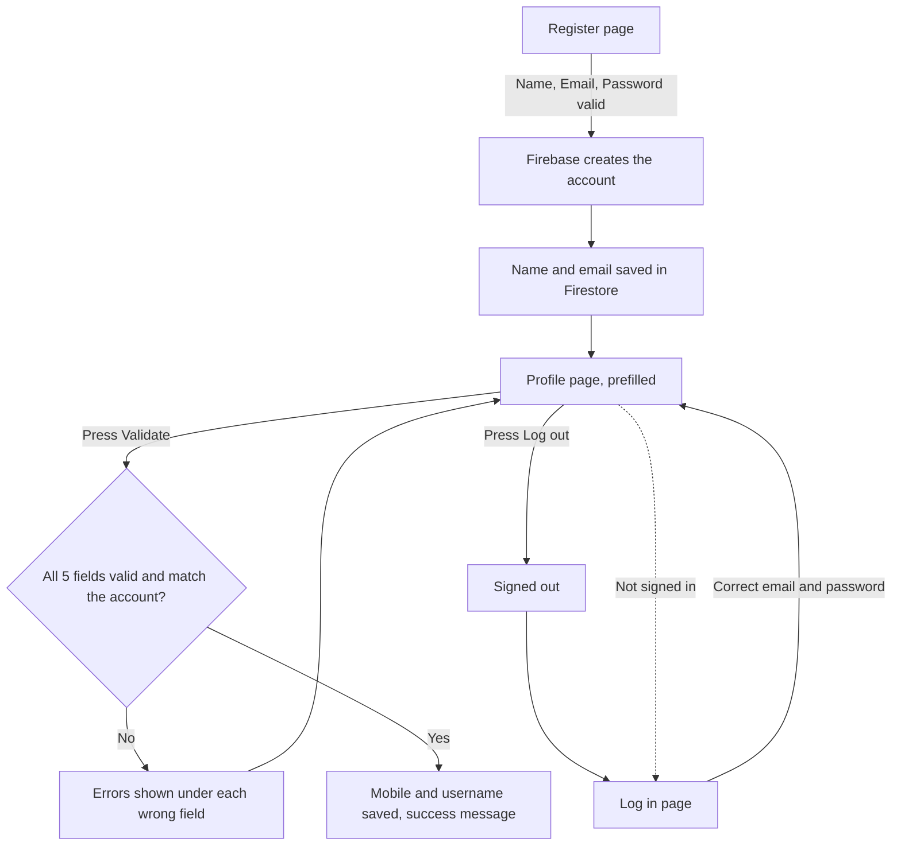

# Auth App

A small, mobile-first web app where a user registers, lands on a prefilled profile form, validates their details, and logs out. Built with plain HTML, CSS and JavaScript, using Firebase for user accounts. There is no backend server.

**Live demo:** `https://YOUR-PROJECT.web.app` (replace after deploying)

---

## What it does

1. **Register** with a name, email and password.
2. Get **redirected to a profile page** where those details are already filled in.
3. Add a mobile number and username, then press **Validate**. Every field is checked, and mistakes show up right under the field.
4. **Log out** at any time. Logged-out visitors cannot open the profile page.
5. **Log in** again later with the same email and password.

It works on phones and desktops. The layout is a single column on small screens and a centred card on wide ones.

---

## Tech stack

| Part | Choice |
|---|---|
| Pages and logic | HTML, CSS, JavaScript (ES modules, no build step) |
| User accounts and sessions | Firebase Authentication (email and password) |
| Extra profile data | Cloud Firestore |
| Hosting (optional) | Firebase Hosting |

---

## Project structure

```
auth-app/
├── index.html        Register page
├── login.html        Log in page
├── profile.html      Profile form with the Validate button
├── styles.css        All styling (mobile first)
└── js/
    ├── firebase.js   Firebase setup and friendly error messages
    ├── validators.js Validation rules and helpers (one place for all regexes)
    ├── register.js   Register page logic
    ├── login.js      Log in page logic
    └── profile.js    Profile page logic: prefill, validate, save, log out
```

---

## How the app flows



### Step by step

1. **Register** (`index.html`, `register.js`): the three fields are checked, then Firebase creates the account. The name and email are also saved in Firestore under the user's id.
2. **Redirect with prefill**: the profile page fills in the name and email from the signed-in user. The password is passed along once through `sessionStorage` and **deleted the moment it is read**, so it is never kept.
3. **Validate** (`profile.js`): all five fields are checked against the rules below. If the format is fine, the name, email and password are also compared with the real account. The password is verified by asking Firebase to re-authenticate, since Firebase never reveals a stored password.
4. **Save**: when everything passes, the mobile number and username are saved to Firestore.
5. **Log out**: signs the user out of Firebase and returns to the log in page.
6. **Guard**: the profile page checks the sign-in state when it loads and sends logged-out visitors to the log in page.

---

## Validation rules

All rules live in `js/validators.js`. No field may be empty.

| Field | Rule | Valid example | Invalid example |
|---|---|---|---|
| Name | Letters only, spaces allowed between words | `John Smith` | `John123` |
| Password | At least one letter and one number | `abc123` | `abcdef` |
| Mobile number | Exactly 10 digits | `9876543210` | `98765` |
| Username | Letters and digits with exactly one special character, no spaces | `john_doe1` | `johndoe`, `12345`, `john__doe1`, `john doe1` |
| Email | Basic `name@domain.tld` format | `a@b.com` | `a@b` |

Firebase also requires passwords to be at least 6 characters when registering.

---

## Setup

### 1. Create the Firebase project
1. Go to the [Firebase console](https://console.firebase.google.com) and click **Create a project**.
2. Click the web icon `</>` to register a web app, and copy the `firebaseConfig` values.
3. Go to **Authentication > Sign-in method**, enable **Email/Password**, and save.
4. Go to **Firestore Database > Create database**, pick a location, and choose **production mode**.
5. Open the Firestore **Rules** tab, paste the rules below, and click **Publish**:

```
rules_version = '2';
service cloud.firestore {
  match /databases/{database}/documents {
    match /users/{userId} {
      allow read, write: if request.auth != null && request.auth.uid == userId;
    }
  }
}
```

These rules let each user read and write only their own document.

### 2. Add your config
Paste your values into `firebaseConfig` in `js/firebase.js`. A Firebase web API key is not a secret. Your Firestore rules are what protect the data.

### 3. Run it locally
ES modules do not load from `file://`, so use a local server:

```
npx serve .
```

Open the address it prints (usually `http://localhost:3000`).

### 4. Deploy (optional)
```
npm install -g firebase-tools
firebase login
firebase init hosting     # public directory: .   single-page app: No
firebase deploy
```

---

## Data stored

Firestore collection `users`, one document per user (the document id is the user's Firebase id):

```
users/{uid}
  name      "John Smith"
  email     "john@example.com"
  mobile    "9876543210"
  username  "john_doe1"
```

The password is **never** stored by this app. Firebase Authentication handles it securely.

---

## Security notes

- Passwords are hashed and stored by Firebase Authentication, not by this app.
- The password prefill uses a one-time `sessionStorage` hand-off that is cleared immediately. After a refresh the field is empty, and the user types the password again.
- The password field is read-only until clicked, which stops browser autofill from refilling it.
- Firestore rules restrict every user to their own document.
- The profile page redirects anyone who is not signed in.

---

## How to test it

1. Register with a new email. You should land on the profile page with name, email and password filled in.
2. Press **Validate** right away. Mobile and username are empty, so you should see "This field is required." under both.
3. Enter `98765` as the mobile number. You should see "Enter exactly 10 digits."
4. Enter `9876543210` and `john_doe1`, then press **Validate**. You should see "All details are valid."
5. Change the name to `John123`. The success message disappears, and Validate shows a red error under Name.
6. Refresh the page. The password field should be empty.
7. Press **Log out**, then try to open `profile.html` directly. You should be sent to the log in page.

---

## Troubleshooting

| Problem | Likely cause |
|---|---|
| Blank page or module errors | The files were opened directly instead of through a local server |
| `auth/operation-not-allowed` | Email/Password sign-in is not enabled in Authentication |
| "Missing or insufficient permissions" | The Firestore rules were not published |
| `auth/api-key-not-valid` | A value in `firebaseConfig` was pasted wrong |
| "Too many attempts" | Firebase temporarily blocked repeated wrong passwords. Wait a few minutes. |